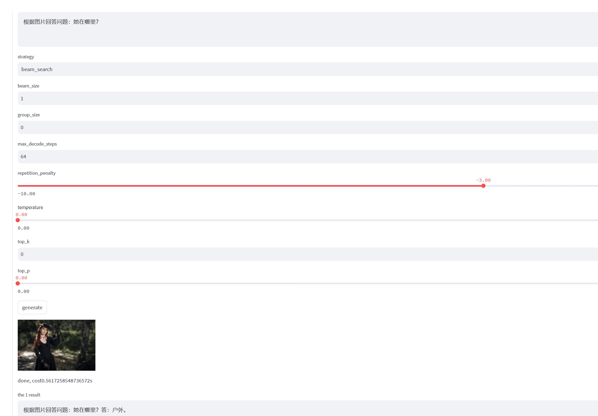

# Chinese vqa

This repo trained Chinese vqa model. 
v2: The v2 version of the model can generate more detailed descriptions.


v1:





If you want to use the model and code, please refer to https://github.com/yaoxiaoyuan/mimix.

```
@misc{mimix,
  title={mimix},
  author={Xiaoyuan Yao},
  year={2021}
}
```

